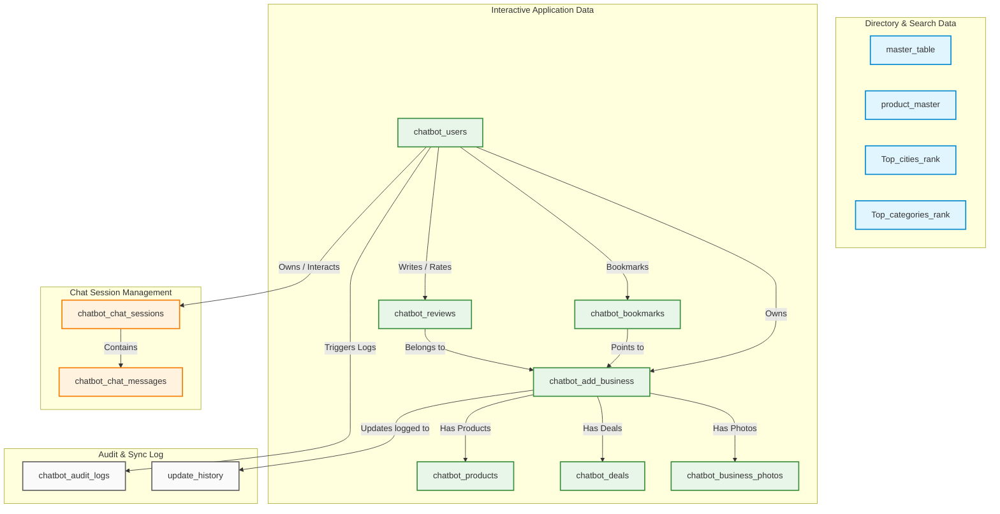

# HoneyBee Digital AI Chatbot — Database Architecture Overview

This document provides a detailed technical breakdown of the MySQL database tables currently connected to the **HoneyBee Digital AI Chatbot** (available in the **Home** tab of the application). It explains the purpose of each table, how they connect to the chatbot, and how they collaborate to deliver directory searches, user interactions, and owner profile management.

---

## 1. Complete List of Connected MySQL Tables

The database architecture is split into three main layers: **Core Search & Directory Data** (mostly read-only lookup data), **Interactive Application Data** (auth, reviews, bookmarks), and **Chat Session Management** (persisting chatbot conversations).



---

## 2. Table Profiles, Purpose, and Connection Points

### A. Chat Session Management

#### 1. `chatbot_chat_sessions`
* **Purpose:** Stores metadata for each individual chatbot conversation thread.
* **Connection to Chatbot:** When a user opens the Home tab, the frontend creates or resumes a session. This table tracks thread titles, pinned status, and which user (registered user ID or guest UUID) owns the conversation.
* **Key Columns:**
  * `id` (VARCHAR(36), Primary Key): UUID generated by the backend (`api.py`).
  * `user_id` (VARCHAR(255), Index): References the phone number, email, or guest UUID of the conversation initiator.
  * `title` (VARCHAR(255)): The title of the session, automatically updated dynamically from the user's first query (truncated to 60 characters).
  * `is_pinned` (TINYINT(1)): Used to keep important sessions at the top of the sidebar.

#### 2. `chatbot_chat_messages`
* **Purpose:** Persists every message exchanged in a chat session.
* **Connection to Chatbot:** Stores the role ('user' or 'assistant') and the content of every message. The backend queries this table (up to a limit of 15 messages) to provide conversation history context to the NLU/LLM parser for multi-turn chats.
* **Key Columns:**
  * `id` (BIGINT, Primary Key, Auto-Increment)
  * `session_id` (VARCHAR(36), Foreign Key): References `chatbot_chat_sessions(id) ON DELETE CASCADE`.
  * `role` (VARCHAR(20)): Identifies if the message came from the `user` or the `assistant`.
  * `content` (LONGTEXT): The actual text query or the JSON response payload (including search results, follow-up suggestions, and action chips).

---

### B. Core Search & Directory Data

#### 3. `master_table`
* **Purpose:** The primary, high-volume directory database containing millions of pre-indexed business listings (equivalent to the local SQLite `g_map_master_table`).
* **Connection to Chatbot:** Queried when the chatbot parses a **Business Search** intent (e.g., *"Show gyms in Ahmedabad"*). The bot reads categories, cities, ratings, and locations to return relevant cards.
* **Key Columns:**
  * Contains business details including `business_name`, `business_category`, `ratings`, `city`, `area`, `working_hour`, `primary_phone`, `website_url`, and latitude/longitude coordinates.

#### 4. `product_master`
* **Purpose:** A read-only global index of products from popular e-commerce marketplaces (Amazon, Blinkit, BigBasket, Flipkart, etc.).
* **Connection to Chatbot:** Used when the user initiates a **Product Search** (e.g., *"Compare prices of AirPods"*). It is queried to find items, stars, pricing, and availability.
* **Key Columns:**
  * `product_name`, `brand`, `price`, `list_price`, `stars`, `reviews`, `availability`, `marketplace_name`, and `image_url`.

#### 5. `Top_cities_rank` & `Top_categories_rank`
* **Purpose:** Pre-calculated rankings of cities and categories based on listing densities.
* **Connection to Chatbot:** Used during the onboarding/reset state of the chatbot. If the user clicks "Business Listings" or "Browse Categories", these tables populate the initial interactive chips (e.g., "Best Gyms", "Restaurants open in Ahmedabad").

---

### C. Interactive Application Data

#### 6. `chatbot_users`
* **Purpose:** Holds credentials and user roles for registered directory users and business owners.
* **Connection to Chatbot:** Used when the chatbot verifies ownership. Actions like *"Show my business"* or *"Add a product"* prompt the bot to check if the active session is logged in against this table.
* **Key Columns:**
  * `id` (BIGINT, Primary Key, Auto-Increment)
  * `email` (VARCHAR(255), Unique) / `phone` (VARCHAR(30), Unique)
  * `password_hash` (VARCHAR(255))
  * `role` (VARCHAR(50)): Defaults to `'owner'` to grant access to dashboard changes.

#### 7. `chatbot_add_business`
* **Purpose:** Stores business listings created, claimed, or modified by registered business owners.
* **Connection to Chatbot:** When an owner edits their profile, adds custom hours, or registers a new establishment through the chatbot interface, the changes are stored here.
* **Key Columns:**
  * `global_business_id` (INT, Primary Key, Auto-Increment)
  * `owner_id` (INT): References `chatbot_users(id)` to establish ownership.
  * Fields mirror `master_table` (`business_name`, `address`, `city`, `ratings`, `phone_number`, etc.).

#### 8. `chatbot_products`
* **Purpose:** Custom products sold by specific local businesses (distinct from global `product_master` items).
* **Connection to Chatbot:** If a user clicks on a local business card, the chatbot can pull active products registered under that `business_id` from this table.
* **Key Columns:**
  * `global_product_id` (INT, Primary Key, Auto-Increment)
  * `business_id` (INT): References `chatbot_add_business(global_business_id)` or `master_table`.
  * `product_name`, `price`, `description`, `image_url`.

#### 9. `chatbot_deals`
* **Purpose:** Discount coupons or promotions published by local businesses.
* **Connection to Chatbot:** Fetched by the chatbot to display active bargains (e.g. *"Show deals for Anjappar Restaurant"*).
* **Key Columns:**
  * `global_deal_id` (INT, Primary Key, Auto-Increment)
  * `business_id` (INT): Links to the business profile.
  * `title`, `discount_pct`, `expiry_date`, `description`.

#### 10. `chatbot_bookmarks` & `chatbot_reviews`
* **Purpose:** Stores user engagements (saved listings and ratings).
* **Connection to Chatbot:** Users can bookmark profiles or post reviews directly inside the chatbot card interface. These tables capture ratings (1-5), user comments, merchant replies, and helpful votes.
* **Key Columns:**
  * `user_id` (VARCHAR(255)): Links back to the user account.
  * `business_id` (BIGINT): Links to the business.

---

### D. Auditing & Sync Logs

#### 11. `chatbot_audit_logs`
* **Purpose:** Tracks security-critical actions executed by users.
* **Connection to Chatbot:** Automatically logs events such as registrations (`REGISTER`), logins (`LOGIN_OTP`), and entity modifications.
* **Key Columns:**
  * `user_id`, `action` (e.g. `REGISTER`, `LOGIN`), `entity` (e.g. `chatbot_users`), `entity_id`, and `ip_address`.

#### 12. `update_history`
* **Purpose:** Logs detailed field changes for synchronization.
* **Connection to Chatbot:** When a business owner updates their business info, the chatbot tracks the exact changes (e.g. changing `website_url` from old to new value) for record-keeping.

---

## 3. How the Tables Work Together: Data Flow Examples

### Flow A: Searching for a Local Business (Customer Flow)
When a user asks: *"Find family-friendly restaurants in Pune"*

```
[User Chat Input]
       │
       ▼
1. "POST /api/query" is received by the backend.
       │
       ▼
2. "chatbot_chat_messages" is appended with the user's message.
       │
       ▼
3. NLU parser extracts entities:
   - Category: "restaurant"
   - City: "Pune"
   - Filter: {"family": True}
       │
       ▼
4. Backend executes query on "master_table":
   - SQL: SELECT * FROM master_table WHERE city LIKE '%Pune%' AND ...
       │
       ▼
   [If 0 rows returned from master_table]
   - Fall back to "query_all_listing_sources()" which searches secondary listing
     tables (e.g., "justdial", "google_map", "yellow_pages").
       │
       ▼
5. Backend normalizes the listings, creates conversational text, and generates chips.
       │
       ▼
6. Backend saves response payload to "chatbot_chat_messages".
       │
       ▼
7. Chatbot UI displays the restaurant cards on the Home tab.
```

### Flow B: Managing a Business Profile (Owner Flow)
When a business owner asks: *"Update my business website"*

```
[User Chat Input]
       │
       ▼
1. Backend verifies auth state:
   - Checks if "session_phone" or "session_email" exists in "chatbot_users".
       │
       ▼
2. Backend gets business profiles owned by this user:
   - Queries "chatbot_add_business" WHERE owner_id = <user_id>.
       │
       ▼
3. Chatbot displays the active business card with update suggestion chips.
       │
       ▼
4. Owner selects "Update Website" and enters the new URL.
       │
       ▼
5. Backend updates "chatbot_add_business" and inserts an audit trail:
   - SQL: UPDATE chatbot_add_business SET website_url = %s WHERE global_business_id = %s
   - SQL: INSERT INTO update_history (business_id, field_name, old_value, new_value) ...
   - SQL: INSERT INTO chatbot_audit_logs (user_id, action, entity, entity_id) ...
       │
       ▼
6. Chatbot replies: "✅ Successfully updated website URL to <new_url>."
```
