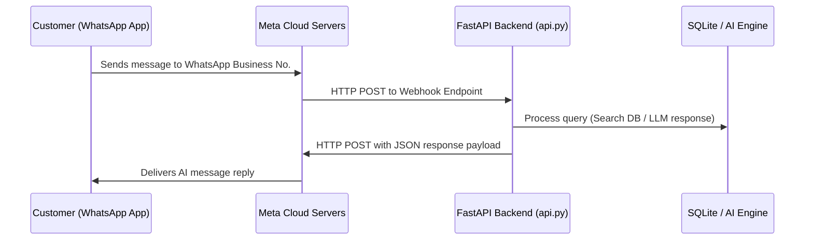
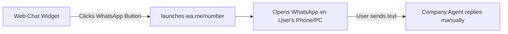
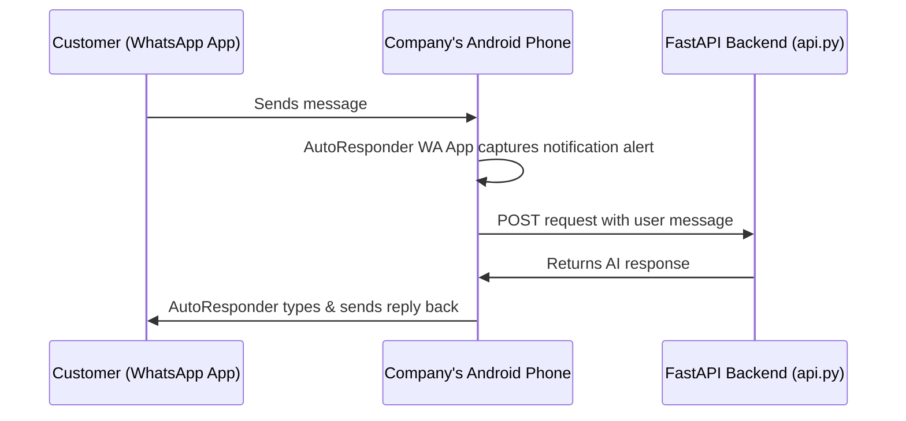
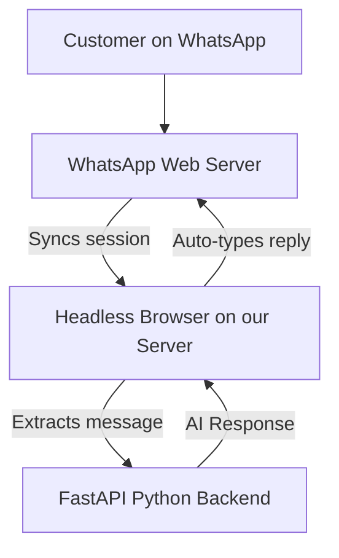

# HBD Local Business AI Chatbot: WhatsApp Integration Proposal

This document outlines the technical options, cost implications, and prerequisite credentials required to integrate the existing **HBD Local Business AI Chatbot** with WhatsApp. 

---

## 🎯 Executive Summary
The HBD chatbot currently runs on the web, connecting users to a local business search database powered by an AI intent classifier and LLM client. To extend this experience to WhatsApp, the system needs to receive messages sent to a WhatsApp number, query the existing FastAPI backend, and respond in real-time.

---

## 📊 Comparison Matrix of Integration Options

| Evaluation Metric | Option 1: Official Meta Cloud API (Recommended) | Option 2: Web "Click-to-Chat" (Redirect Only) | Option 3: Android AutoResponder (Best for Demos) | Option 4: Headless Web Automation (Self-Hosted) |
| :--- | :--- | :--- | :--- | :--- |
| **UX Flow** | Official AI Chatbot auto-replies directly on WhatsApp. | User clicks button on Web and chats manually with a human. | Official-looking AI bot auto-replies from an Android device. | Unofficial AI bot auto-replies from backend server. |
| **API Cost** | **Free for first 1,000 conversations/month** | 🪙 **100% Free** | 🪙 **100% Free** | 🪙 **100% Free** |
| **Account Ban Risk**| **Zero** (Approved by Meta). | **Zero** (Official redirect). | **Low** (Uses normal WhatsApp app). | ⚠️ **High** (Meta bans unofficial automation). |
| **Hardware Required**| Cloud Backend Server only. | None (Client/User side only). | 📱 **Dedicated Android Phone** (Always On). | Cloud Backend Server only. |
| **Setup Effort** | Medium (Requires Meta App setup & card). | Low (Just a React button). | Medium (Install app on phone + setup proxy). | High (Setup headless browser scripts on server). |

---

## 🛠️ Option-by-Option Breakdown & Action Plans

### 1️⃣ Option 1: Official Meta Cloud API (Recommended for Production)
The official WhatsApp Business Cloud API hosted by Meta. This allows programmatic, safe, and stable automated chat.

#### 🔄 Architecture Flow:

#### 📋 Prerequisites to Request from your Organization:
To implement this option, the business coordinators/IT admin must supply you with the following from the **Meta Developer Portal**:
1. **Meta Developer Account** associated with the company.
2. **Meta Business Suite Account** (must be verified for production use).
3. **Credit Card on File** (Meta requires a card for verification, although the first **1,000 service conversations per month are 100% free**).
4. **Temporary / Permanent Access Token** (System User Token with `whatsapp_business_messaging` permissions).
5. **Phone Number ID** (available in WhatsApp Setup tab).
6. **WhatsApp Business Account ID** (WABA ID).

> [!TIP]
> **Share this setup link with your Business Team:**  
> [Meta WhatsApp Cloud API Get Started Guide](https://developers.facebook.com/docs/whatsapp/cloud-api/get-started)

---

### 2️⃣ Option 2: Web "Click-to-Chat" (Redirect Only)
No actual chatbot is deployed on WhatsApp. Instead, we add a beautiful floating widget or button to the web chat. When clicked, it opens WhatsApp with a prefilled message.

#### 🔄 Architecture Flow:

#### 📋 Prerequisites to Request from your Organization:
1. **The Company Phone Number** (Any number registered on the WhatsApp standard or business mobile app).
2. **Preferred Default Message Text** (e.g., *"Hi! I'm visiting your website and want to manage my business listing..."*).

---

### 3️⃣ Option 3: Android AutoResponder (Best for Low-Cost Demos)
Ideal for testing or internal presentations without creating Meta developer profiles. We use an app on a physical Android phone to intercept notifications and route them to our FastAPI backend.

#### 🔄 Architecture Flow:

#### 📋 Prerequisites to Request from your Organization:
1. **A dedicated Android Phone** linked to the company's WhatsApp number.
2. **Continuous internet access** and power for the Android phone.
3. Install the **AutoResponder for WA** app from the Google Play Store (only on this specific phone).
4. **Ngrok or Cloud public URL** to map the local FastAPI server to the internet.

---

### 4️⃣ Option 4: Headless Web Automation (Self-Hosted)
Runs a script (Node.js/Chromium browser wrapper) on the backend server that emulates WhatsApp Web.

#### 🔄 Architecture Flow:

#### 📋 Prerequisites to Request from your Organization:
1. **A standard WhatsApp account** (personal or business app).
2. **One-time access to scan a QR code** generated by the server terminal to link the web session (done via *Linked Devices* in WhatsApp settings).
3. **Disclaimer Acceptance:** The company must acknowledge that Meta may block or ban the WhatsApp number if automation speeds or spam triggers are detected.

---

## 🗺️ Next Steps & Action Items

Please share this guide with your organization's decision-makers to choose a path:

* **For Production:** Choose **Option 1**. Request your company's IT admin to configure the Meta developer keys.
* **For a Fast & Simple solution:** Choose **Option 2**. We can add a WhatsApp shortcut widget on the web page instantly.
* **For a zero-cost demonstration:** Choose **Option 3** (Android helper) or **Option 4** (Headless node).
